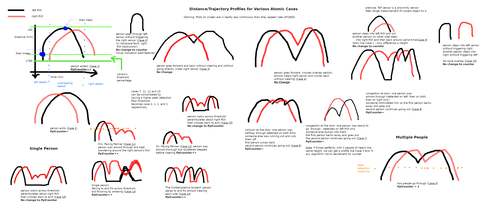

#People Counter Algorithm

###Author: [Michael Kehinde](kehindem@mcmaster.ca)

## Configuration

There are two regions of interest (ROI): left ROI and right ROI. 

Each region of interest has an associated field of view and overlap region. 

The following figure illustrates the distance trajectory profile for various cases. Note that the sampled distance data may not be smooth. (The class PeakDetector is used to process data points to extract peak information. Several parameters were made available to facilitate processing data sets with different amplitudes and noise levels). 

A "peak" refers to a local minima in the data set. Each peak in the distance trajectory profile represents either a traversal across the centre of the region of interest (ROI) or a change in direction. Due to the sensor configuration, objects that are closer to the sensor will have a lower distance value and vice versa.

A traversal across the left zone and then the right zone is an entrance. A traversal across the right zone and then the left zone is an exit. 

## Algorithm Description 

L => left zone  
R => right zone

	 
>Once someone is detected in a zone:
> 
>>Initialize a tmp counter and a two-peak moving window. Initialize a peak counter.
>>
>> Move the window across the first two peaks.
>>
>> **Subroutine A**  
>>> If the peaks in the window make a LR or RL pair:  
>>>> If the magnitudes of the peaks are within a specified tolerance to each other:
>>>> 
>>>> 
>>>>>Increment tmp by 1 if the peaks make a LR pair.  
>>>>>Decrement tmp by 1 if the peaks make a RL pair.  
>>>>>Increment the peak counter by 2.  
>>>>
>>>>Otherwise:  
>>>>
>>>>>Increment the peak counter by 1.  
>>>>
>>>>Move the window over by two peaks and repeat **Subroutine A.**
>>>

>>> Otherwise: move the window over by one peak and repeat **Subroutine A.**

>>>If there is only one peak left in the data set:  
>>>>Increment tmp by 1 if the last peak is R and was preceded by a L peak  
>>>>Decrement tmp by 1 if the last peak is L and was preceded by an R peak  
>>>>Increment the peak counter by 1.

>>If the last peak occurred in the same zone as the first peak and the peak counter value is an odd number:  
>>>Multiply tmp by -1.  

>If both zones had been occupied at any point in time:  
>>Add tmp to the people count to compute the final count.

## Limitations: 
The scope of the project was to track single-file, bi-directional movement of people. 

Support for the following cases were beyond the scope and requirements of the project: 

1. Two people on opposing sides collide in the middle region and then walk away in opposite sides.  
2. Two people from opposing sides meet in the middle region and slide past each other. 
3. Two people on opposing sides collide in the middle region and then walk away in one side. Then another person enters the field of view and before the two people leave the field of view. The third person crosses completely. 

Note that it is not be possible using distance data collected from the sensor alone to distinguish at which point in time a net direction change occurred when at least two people are in the field of view. Depending on the timing, the software will report all people in the aforementioned cases as having entered or having exited. However, configuring the sensor and minimizing the field of view will greatly improve the performance of the system. 
